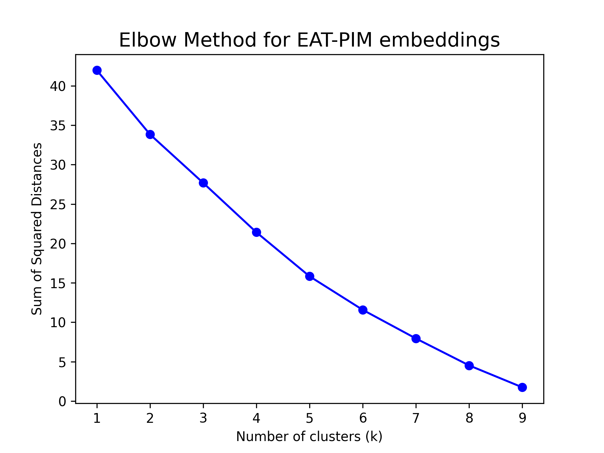
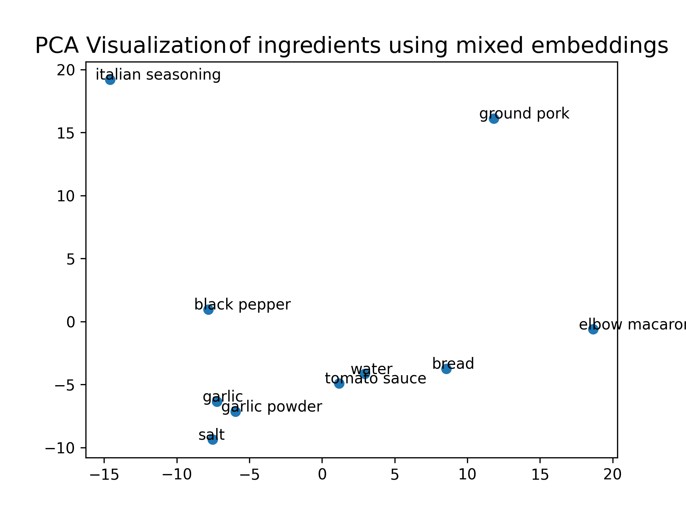

# Recipe Generation - Based on Eat-PIM

## Team members

- Sofya Aksenyuk, 150284
- Uladzimir Ivashka, 150281

## Main idea

The goal is to introduce a model that would be capable of generating new recipes based on a user's input ingredients. 

Based on Eat-PIM and FlavorGraph generated embeddings, the input user's ingredients would result in a FlowGraph, presenting the recipe proposed by the model.

## Project source code

Source code to the project can be found here: [Source code](https://github.com/aksenyuk/recipe-generation)

## Chain of work

- Parse provided ingredients
- Match infringements with FoodOn and Wikidata entities
- Choose most relevant ingredients (that make sense together out of list of ingredients)
- Generate a set of the most applicable actions for these ingredients
- Create a FlowGraph from these ingredients and actions

## EDA 

Source code to EDA can be found here: [EDA](https://github.com/aksenyuk/recipe-generation/small_eda.ipynb)

## Algorithm

### Step 1 - Parse provided ingredients

Source code to Data Parser can be found here: [Data Parser](https://github.com/aksenyuk/recipe-generation/src/parse_data.py)

#### Main methods used in data parsing:

- Parsing Matches (parse_matches): Read files that contain mappings between ingredients and other entities (like FoodOn and Wikidata), then reformat and save this data for later use

- Parsing Flow Graphs (parse_flow_graphs): Process recipe flow graph data, which helps in understanding the sequence and hierarchy in recipes, and save the processed data

- Parsing Entities Embeddings (parse_entities_embeddings): Handle embeddings related to ingredients and other entities by reading, normalizing, and computing cosine similarity matrices

- Parsing Actions Embeddings (parse_actions_embeddings): Process action-related embeddings

- Parsing Co-occurrence Data (parse_cooc): Analyze ingredient co-occurrence data to explore common pairings and potential novel combinations in recipes

#### Example of User Input

### Step 2 - Match infringements with FoodOn and Wikidata entities

Source code to Ingredient Selection can be found here: [Ingredient Selection](https://github.com/aksenyuk/recipe-generation/src/ingredients_selection.py)

#### Main methods used in ingredient selection:

- Identifying Existing Ingredients (ingredients_existing_in_cooc): Filter the input list of ingredients to retain only those present in the co-occurrence dataset. If an ingredient is not directly found, the class attempts to match its short form from the loaded mappings.

- Calculating the Threshold (determine_threshold): Determine a threshold value for ingredient selection based on their similarity scores in the co-occurrence matrix. The percentile for this threshold is manually adjustable.

- Selecting Ingredients:
    - Initial Selection Process (select): Select the most common ingredient based on the co-occurrence data. Add ingredients to meet a minimum count requirement, ensuring a basic selection diversity.
    - Expanding the Selection: Continue adding ingredients based on their similarity scores with already selected ingredients. This process continues until the average similarity score falls below the determined threshold.

#### Example of Selected Ingredients

### Step 3 - Generate a set of the most applicable actions for these ingredients and create a FlowGraph

#### Cluster selected ingredients 

Source code to Clustering can be found here: [Clustering](https://github.com/aksenyuk/recipe-generation/src/clustering.py)

- Apply Elbow method to determine the number of clusters:

    - For Eat-PIM embeddings: 

    
    
    **Conclusions:** No particular Number of clusters (k) can be determined

    - Then, for mix FlavorGraph and EaT-PIM embeddings: 

    
    
    **Conclusions:** clearly defined k = 4 Number of clusters

#### Clusters k=4 visualization for selected ingredients

#### Determine actions (One cluster - one action):

- Calculate cosine similarity for ingredient-action embeddings: 

**Conclusions:** Actions do not make sense: elbow macaroni - burn; ground pork - support, etc. Therefore, cosine similarity cannot be used for these embeddings, due to the specification of EaT-PIM embeddings

- Workaround: 

    - By the use of Tf-Idf, process all recipes used in embeddings to find the most similar recipes to our set of ingredients: 

    
    
    Source code to Tf-Idf Embeddings can be found here: [Tf-Idf Embeddings](https://github.com/aksenyuk/recipe-generation/src/tf_idf.py)

    Source code to Final Recipe Acquisition can be found here: [Final Recipe Acquisition](https://github.com/aksenyuk/recipe-generation/src/checker.py)

    **Conclusions:** The most similar recipe was determined (RECIPE_OUTPUT_323553)

    - Take actions from the final recipe and apply them to our ingredients: 

    
    
    **Conclusions:** This way we could determine more relevant actions to the set of ingredients: elbow macaroni - cover; ground pork - cook, etc.

## Resources

- [Eat-PIM source code](https://github.com/boschresearch/EaT-PIM/tree/main)
